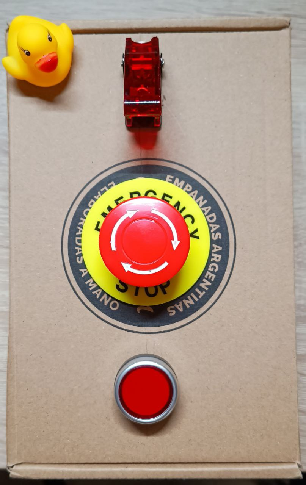

# AWS NUKE BUTTON PROJECT

## Description

AWS Nuke Button is a simple shitty project to use an ESP-C3 board, a switch and a button to emulate a RED BUTTON that destroys all resources in the students laboratory account.
It is designed as a funny and totally innecesary overengineered project to delete all "left behind"" resources every week in the students lab account.

## How it started

The project started as a joke, but it turned out to be a fun and useful project. The idea was to create a button that would delete all resources in the students lab account, but it quickly evolved into a more complex project that includes an ESP-C3 board, a switch, a test button and a emergency button as NUKE BUTTON.

## How it works

The project uses an ESP-C3 board to connect to the internet and send a request to our ✨FANCY NEW ARCHITECTURE✨. Gone are the days of overpriced Fargate tasks - we've gone full cheapskate mode!

Now our little ESP-C3 board sends a request straight to an API Gateway, which triggers a Lambda function running the aws-nuke container. It's like we fired the middle manager (Fargate) and let the intern (Lambda) do all the work! 💸💸💸

When you press the test button, it triggers a dry-run via the API. If the Lambda responds with "all systems ready to obliterate" (or some boring HTTP 200 code), the red emergency button lights up like Christmas morning. Press that bad boy, and KABOOM! 💥 All those pesky AWS resources go bye-bye.

To recap (because we know reading is hard):

- The switch is used to turn on and off the ESP-C3 board (duh).
- The test button is like asking "are you sure?" before deleting your ex from your contacts.
- The emergency button is basically a digital nuke that makes AWS resources disappear faster than your money in a Steam sale.

## Why Our New Approach Is Better

Our previous approach was like using a bulldozer to kill a fly - complete overkill (and expensive as hell). The new setup:

1. **Costs less than a cup of coffee** - Lambda is crazy cheap compared to keeping Fargate tasks around
2. **Is faster than your professor's ancient laptop** - Direct API calls mean less waiting around
3. **Has fewer moving parts than a dollar store toy** - Fewer services = fewer things to break

Remember kids, the cloud is just someone else's computer - but with our shiny red button, it's someone else's computer that you can DESTROY WITH IMPUNITY! 😱

## Getting Started

### Hardware

- ESP-C3 board (or any other ESP board)
- Switch
- Test button
- Emergency button
- Resistors
- Breadboard
- Jumper wires
- Power supply (USB or battery)
- Optional: LED for visual feedback
- Optional: Buzzer for audio feedback
- Optional: Enclosure to protect the components
- Optional: 3D printed case for a more professional look
- Optional: Label maker to add some fancy labels to the buttons
- Optional: Stickers to make it look cool
- Optional: A small sign that says "NUKE BUTTON" to make it clear what it does
- Optional: A small sign that says "DO NOT PRESS" to make it even more tempting
- Optional: A small sign that says "FOR EMERGENCIES ONLY" to make it sound more serious
- Optional: A small sign that says "USE AT YOUR OWN RISK" to make it sound more dangerous
- Optional: A small sign that says "NOT RESPONSIBLE FOR ANY DAMAGE" to make it sound more legal
- Optional: A small sign that says "NOT FOR USE IN PRODUCTION" to make it sound more professional
- Optional: A small sign that says "FOR EDUCATIONAL PURPOSES ONLY" to make it sound more academic
- Optional: A small sign that says "FOR FUN ONLY" to make it sound more fun
- Optional: A small sign that says "FOR SCIENCE" to make it sound more scientific
- Optional: A small sign that says "FOR THE LOLZ" to make it sound more humorous
- Optional: A small sign that says "FOR THE MEMES" to make it sound more meme-worthy
- Optional: A small sign that says "FOR THE WIN" to make it sound more victorious
- Optional: A small sign that says "FOR THE GLORY" to make it sound more glorious
- Optional: A small sign that says "FOR THE FUN OF IT" to make it sound more fun
- Optional: A small sign that says "FOR THE HELL OF IT" to make it sound more rebellious
- Optional: A small sign that says "FOR THE SAKE OF IT" to make it sound more philosophical
- Optional: A small sign that says "FOR THE LOVE OF IT" to make it sound more romantic
- Optional: A small sign that says "FOR THE JOY OF IT" to make it sound more joyful
- Optional: A small sign that says "FOR THE THRILL OF IT" to make it sound more thrilling
- Optional: A small sign that says "FOR THE ADVENTURE" to make it sound more adventurous
- Optional: A small sign that says "FOR THE RIDE" to make it sound more exciting
- Optional: A small sign that says "FOR THE EXPERIENCE" to make it sound more experiential
- Optional: A small sign that says "FOR THE FUN OF SCIENCE" to make it sound more scientific
- Optional: A small sign that says "FOR THE FUN OF TECHNOLOGY" to make it sound more technological
- Optional: A small sign that says "FOR THE FUN OF ENGINEERING" to make it sound more engineering
- Optional: A small sign that says "FOR THE FUN OF PROGRAMMING" to make it sound more programming
- Optional: A small sign that says "FOR THE FUN OF CODING" to make it sound more coding
- Optional: A small sign that says "FOR THE FUN OF HACKING" to make it sound more hacking
- Optional: A small sign that says "FOR THE FUN OF MAKING" to make it sound more making
- Optional: A small sign that says "FOR THE FUN OF CREATING" to make it sound more creating

### Software

- ESP-IDF (Espressif IoT Development Framework)
- AWS CLI
- AWS SDK for Python (Boto3)
- AWS Lambda
- AWS API Gateway
- AWS IAM
- Terraform
- Docker
- Python
- Flask
- Requests
- JSON

## Building the base infrastructure

terraform/
├── main.tf
├── variables.tf
├── outputs.tf
├── vpc.tf
├── lambda.tf
├── api-gateway.tf
└── iam.tf