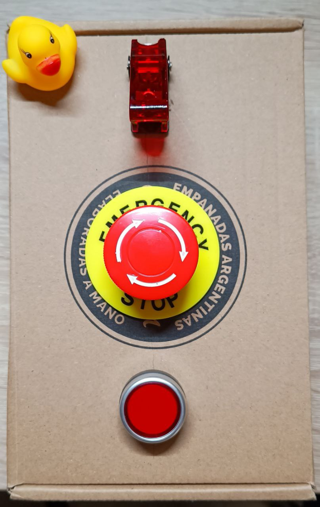

# AWS NUKE BUTTON PROJECT

## Description

AWS Nuke Button is a simple shitty project to use an ESP-C3 board, a switch and a button to emulate a RED BUTTON that destroys all resources in the students laboratory account.
It is designed as a funny and totally innecesary overengineered project to delete all orphan resources every week in the students lab account.

## How it started

The project started as a joke, but it turned out to be a fun and useful project. The idea was to create a button that would delete all resources in the students lab account, but it quickly evolved into a more complex project that includes an ESP-C3 board, a switch, a test button and a emergency button as NUKE BUTTON.

## How it works

The project uses an ESP-C3 board to connect to the internet and send a request to a Lambda function that calls an fargate task that, running aws-nuke docker image, deletes all resources in the students lab account. The button is connected to the ESP-C3 board and when pressed, it sends a request to the Lambda function to run a dry-run. If the dry-run is OK, you are ready to push the emergency button to NUKE ALL.
To recap:
The switch is used to turn on and off the ESP-C3 board.
The test button is used to test the connection to the Lambda function, the fargate task and the AWS Nuke command.
The emergency button is used to NUKE ALL resources in the students lab account.
